# MathML and LaTeX Examples

## Example 1

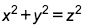

Latex:

```
x^2+y^2=z^2
```

MathML:

```xml
<math xmlns="http://www.w3.org/1998/Math/MathML"><msup><mi>x</mi><mn>2</mn></msup><mo>+</mo><msup><mi>y</mi><mn>2</mn></msup><mo>=</mo><msup><mi>z</mi><mn>2</mn></msup></math>
```

## Example 2

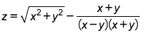

Latex:

```
z=\sqrt{x^2+y^2}-\frac{x+y}{(x-y)(x+y)}
```

MathML:

```xml
<math xmlns="http://www.w3.org/1998/Math/MathML"><mi>z</mi><mo>=</mo><msqrt><msup><mi>x</mi><mn>2</mn></msup><mo>+</mo><msup><mi>y</mi><mn>2</mn></msup></msqrt><mo>-</mo><mfrac><mrow><mi>x</mi><mo>+</mo><mi>y</mi></mrow><mrow><mo>(</mo><mi>x</mi><mo>-</mo><mi>y</mi><mo>)</mo><mo>(</mo><mi>x</mi><mo>+</mo><mi>y</mi><mo>)</mo></mrow></mfrac></math>
```

## Example 3

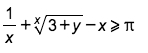

Latex:

```
\frac1x+\sqrt[x]{3+y}-x\geqslant\mathrm\pi
```

MathML:

```xml
<math xmlns="http://www.w3.org/1998/Math/MathML"><mfrac><mn>1</mn><mi>x</mi></mfrac><mo>+</mo><mroot><mrow><mn>3</mn><mo>+</mo><mi>y</mi></mrow><mi>x</mi></mroot><mo>-</mo><mi>x</mi><mo>&#x2A7E;</mo><mi mathvariant="normal">&#x3C0;</mi></math>
```

## Example 4

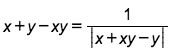

Latex:

```
x+y-xy=\frac1{\left|x+xy-y\right|}
```

MathML:

```xml
<math xmlns="http://www.w3.org/1998/Math/MathML"><mi>x</mi><mo>+</mo><mi>y</mi><mo>-</mo><mi>x</mi><mi>y</mi><mo>=</mo><mfrac><mn>1</mn><mfenced open="|" close="|"><mrow><mi>x</mi><mo>+</mo><mi>x</mi><mi>y</mi><mo>-</mo><mi>y</mi></mrow></mfenced></mfrac></math>
```

## Example 5

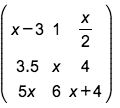

```
\begin{pmatrix}x-3&1&\frac x2\\3.5&x&4\\5x&6&x+4\end{pmatrix}
```

MathML:

```xml
<math xmlns="http://www.w3.org/1998/Math/MathML"><mfenced><mtable><mtr><mtd><mi>x</mi><mo>-</mo><mn>3</mn></mtd><mtd><mn>1</mn></mtd><mtd><mfrac><mi>x</mi><mn>2</mn></mfrac></mtd></mtr><mtr><mtd><mn>3</mn><mo>.</mo><mn>5</mn></mtd><mtd><mi>x</mi></mtd><mtd><mn>4</mn></mtd></mtr><mtr><mtd><mn>5</mn><mi>x</mi></mtd><mtd><mn>6</mn></mtd><mtd><mi>x</mi><mo>+</mo><mn>4</mn></mtd></mtr></mtable></mfenced></math>
```

## Example 6

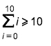

```
\overset{10}{\underset{i=0}{\sum i}}\geqslant10
```

MathML:

```xml
<math xmlns="http://www.w3.org/1998/Math/MathML"><munderover><mrow><mo>&#x2211;</mo><mi>i</mi></mrow><mrow><mi>i</mi><mo>=</mo><mn>0</mn></mrow><mn>10</mn></munderover><mo>&#x2A7E;</mo><mn>10</mn></math>
```

## Example 7

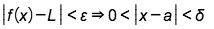

```
\left|f(x)-L\right|<\varepsilon\Rightarrow0<\left|x-a\right|<\delta
```

MathML:

```xml
<math xmlns="http://www.w3.org/1998/Math/MathML"><mfenced open="|" close="|"><mrow><mi>f</mi><mo>(</mo><mi>x</mi><mo>)</mo><mo>-</mo><mpadded lspace="-1px"><mi>L</mi></mpadded></mrow></mfenced><mo>&lt;</mo><mi>&#x3B5;</mi><mo>&#x21D2;</mo><mn>0</mn><mo>&lt;</mo><mfenced open="|" close="|"><mrow><mi>x</mi><mo>-</mo><mi>a</mi></mrow></mfenced><mo>&lt;</mo><mi>&#x3B4;</mi></math>
```

## Example 8

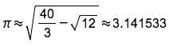

Latex:

```
\pi\approx\sqrt{\frac{40}3-\sqrt{12}}\approx3.141533
```

MathML:

```xml
<math xmlns="http://www.w3.org/1998/Math/MathML"><mi>&#x3C0;</mi><mo>&#x2248;</mo><msqrt><mfrac><mn>40</mn><mn>3</mn></mfrac><mo>-</mo><msqrt><mn>12</mn></msqrt></msqrt><mo>&#x2248;</mo><mn>3</mn><mo>.</mo><mn>141533</mn></math>
```

## Example 9

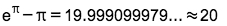

Latex:

```
\mathrm e^{\mathrm\pi}-\mathrm\pi=19.999099979...\approx20
```

MathML:

```xml
<math xmlns="http://www.w3.org/1998/Math/MathML"><msup><mi mathvariant="normal">e</mi><mi mathvariant="normal">&#x3C0;</mi></msup><mo>-</mo><mi mathvariant="normal">&#x3C0;</mi><mo>=</mo><mn>19</mn><mo>.</mo><mn>999099979</mn><mo>.</mo><mo>.</mo><mo>.</mo><mo>&#x2248;</mo><mn>20</mn></math>
```

## Example 10

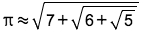

Latex:

```
\mathrm\pi\approx\sqrt{7+\sqrt{6+\sqrt5}}
```

MathML:

```xml
<math xmlns="http://www.w3.org/1998/Math/MathML"><mi mathvariant="normal">&#x3C0;</mi><mo>&#x2248;</mo><msqrt><mn>7</mn><mo>+</mo><msqrt><mn>6</mn><mo>+</mo><msqrt><mn>5</mn></msqrt></msqrt></msqrt></math>
```

## Example 11

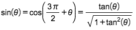

Latex:

```
\sin\left(\theta\right)=\cos\left(\frac{3\pi}2+\theta\right)=\frac{\tan\left(\theta\right)}{\sqrt{1+\tan^2\left(\theta\right)}}
```

MathML:

```xml
<math xmlns="http://www.w3.org/1998/Math/MathML"><mi>sin</mi><mfenced><mi>&#x3B8;</mi></mfenced><mo>=</mo><mi>cos</mi><mfenced><mrow><mfrac><mrow><mn>3</mn><mi>&#x3C0;</mi></mrow><mn>2</mn></mfrac><mo>+</mo><mi>&#x3B8;</mi></mrow></mfenced><mo>=</mo><mfrac><mrow><mi>tan</mi><mfenced><mi>&#x3B8;</mi></mfenced></mrow><msqrt><mn>1</mn><mo>+</mo><msup><mi>tan</mi><mn>2</mn></msup><mfenced><mi>&#x3B8;</mi></mfenced></msqrt></mfrac></math>
```

## Example 12

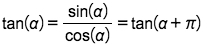

Latex:

```
\tan\left(\alpha\right)=\frac{\sin\left(\alpha\right)}{\cos\left(\alpha\right)}=\tan\left(\alpha+\pi\right)
```

MathML:

```xml
<math xmlns="http://www.w3.org/1998/Math/MathML"><mi>tan</mi><mfenced><mi>&#x3B1;</mi></mfenced><mo>=</mo><mfrac><mrow><mi>sin</mi><mfenced><mi>&#x3B1;</mi></mfenced></mrow><mrow><mi>cos</mi><mfenced><mi>&#x3B1;</mi></mfenced></mrow></mfrac><mo>=</mo><mi>tan</mi><mfenced><mrow><mi>&#x3B1;</mi><mo>+</mo><mi>&#x3C0;</mi></mrow></mfenced></math>
```

## Example 13

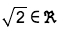

Latex:

```
\sqrt2\in\mathfrak R
```

MathML:

```xml
<math xmlns="http://www.w3.org/1998/Math/MathML"><msqrt><mn>2</mn></msqrt><mo>&#x2208;</mo><mi mathvariant="fraktur">R</mi></math>
```

## Example 14

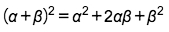

Latex:

```
{(\alpha+\beta)}^2=\alpha^2+2\alpha\beta+\beta^2
```

MathML:

```xml
<math xmlns="http://www.w3.org/1998/Math/MathML"><msup><mrow><mo>(</mo><mi>&#x3B1;</mi><mo>+</mo><mi>&#x3B2;</mi><mo>)</mo></mrow><mn>2</mn></msup><mo>=</mo><msup><mi>&#x3B1;</mi><mn>2</mn></msup><mo>+</mo><mn>2</mn><mi>&#x3B1;</mi><mi>&#x3B2;</mi><mo>+</mo><msup><mi>&#x3B2;</mi><mn>2</mn></msup></math>
```

## Example 15

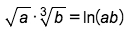

Latex:

```
\sqrt a\cdot\sqrt[3]b=\ln\left(ab\right)
```

MathML:

```xml
<math xmlns="http://www.w3.org/1998/Math/MathML"><msqrt><mi>a</mi></msqrt><mo>&#xB7;</mo><mroot><mi>b</mi><mn>3</mn></mroot><mo>=</mo><mi>ln</mi><mfenced><mrow><mi>a</mi><mi>b</mi></mrow></mfenced></math>
```

## Example 16

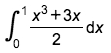

Latex:

```
\int_0^1\frac{x^3+3x}2\operatorname dx
```

MathML:

```xml
<math xmlns="http://www.w3.org/1998/Math/MathML"><msubsup><mo>&#x222B;</mo><mn>0</mn><mn>1</mn></msubsup><mfrac><mrow><msup><mi>x</mi><mn>3</mn></msup><mo>+</mo><mn>3</mn><mi>x</mi></mrow><mn>2</mn></mfrac><mo>d</mo><mi>x</mi></math>
```

## Example 17

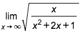

Latex:

```
\lim_{x\rightarrow\infty}\sqrt{\frac x{x^2+2x+1}}
```

MathML:

```xml
<math xmlns="http://www.w3.org/1998/Math/MathML"><munder><mi>lim</mi><mrow><mi>x</mi><mo>&#x2192;</mo><mo>&#x221E;</mo></mrow></munder><msqrt><mfrac><mi>x</mi><mrow><msup><mi>x</mi><mn>2</mn></msup><mo>+</mo><mn>2</mn><mi>x</mi><mo>+</mo><mn>1</mn></mrow></mfrac></msqrt></math>
```

## Example 18

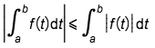

Latex:

```
\left|\int_a^bf(t)\operatorname dt\right|\leqslant\int_a^b\left|f(t)\right|\operatorname dt
```

MathML:

```xml
<math xmlns="http://www.w3.org/1998/Math/MathML"><mfenced open="|" close="|"><mrow><msubsup><mo>&#x222B;</mo><mi>a</mi><mi>b</mi></msubsup><mi>f</mi><mo>(</mo><mi>t</mi><mo>)</mo><mo>d</mo><mi>t</mi></mrow></mfenced><mo>&#x2A7D;</mo><msubsup><mo>&#x222B;</mo><mi>a</mi><mi>b</mi></msubsup><mfenced open="|" close="|"><mrow><mi>f</mi><mo>(</mo><mi>t</mi><mo>)</mo></mrow></mfenced><mo>d</mo><mi>t</mi></math>
```

## Example 19

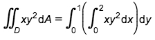

Latex:

```
\iint_Dxy^2\operatorname dA=\int_0^1\left(\int_0^2xy^2\operatorname dx\right)\operatorname dy
```

MathML:

```xml
<math xmlns="http://www.w3.org/1998/Math/MathML"><msub><mo>&#x222C;</mo><mi>D</mi></msub><mi>x</mi><msup><mi>y</mi><mn>2</mn></msup><mo>d</mo><mi>A</mi><mo>=</mo><msubsup><mo>&#x222B;</mo><mn>0</mn><mn>1</mn></msubsup><mfenced><mrow><msubsup><mo>&#x222B;</mo><mn>0</mn><mn>2</mn></msubsup><mi>x</mi><msup><mi>y</mi><mn>2</mn></msup><mo>d</mo><mi>x</mi></mrow></mfenced><mo>d</mo><mi>y</mi></math>
```

## Example 20

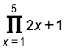

Latex:

```
\prod_{x=1}^52x+1
```

MathML:

```xml
<math xmlns="http://www.w3.org/1998/Math/MathML"><munderover><mo>&#x220F;</mo><mrow><mi>x</mi><mo>=</mo><mn>1</mn></mrow><mn>5</mn></munderover><mn>2</mn><mi>x</mi><mo>+</mo><mn>1</mn></math>
```
